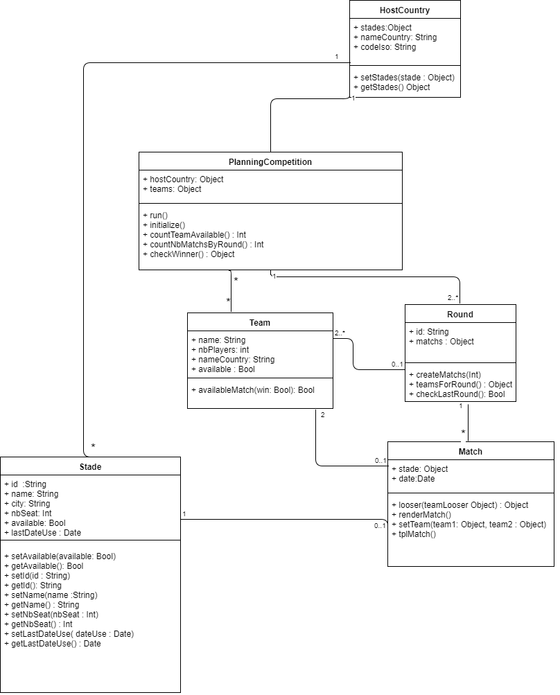

# World Cup Software.

## Introduction
Ce logiciel d’organisation de compétitions organise des matchs d’équipes en fonction des stades disponibles et d’un tirage pseudo-aléatoire.

## Mode d’emploi 
Une fois les valeurs entrées dans le code, lancez-le : le planning doit être affiché. 

## Contraintes
Chaque match a un stade, un moment, deux équipes.
Chaque stade a besoin d’une journée de préparation avant le match (sécurité) et après (nettoyage), un lieu, un nom.
Les équipes ont besoin de repos : maximum 2 jours de matchs consécutifs.
4 matchs maximum par jour, 2 matchs maximum à la fois (2 le matin et 2 le soir par exemple).

## Composants
Date = moment du match (jour, heure).

Il y a un pays organisateur, qui a des stades disponibles.
Les stades sont créés dans la classe du pays organisateur.

Chaque équipe a un nom. 

avaliableMatch: Bool : indique si l’entité (stade ou équipe) est disponible pour un match en ces circonstances (date…).

## Diagramme

// TODO : à revoir.

## Méthodes et noms des classes
### @Constructeur :
#### Paramètres : 
Nom           | Type   | Valeur 
+ stades      | Object | {}
+ nameCountry | String | 
+ codeIso     | String |
--------------| ------ | -------

### Fonctions :

#### **_hostCountry()**

Nom           | Type   | Valeur 
+ stades      | Object |
+ nameCountry | String |
+ codeIso     | String |
--------------| ------ | -------

#### **_PlanningCompetition()**
Nom           | Type   | Valeur 
+ host country | String |
+ teams      | Object |

round

Team

Stade

Match
